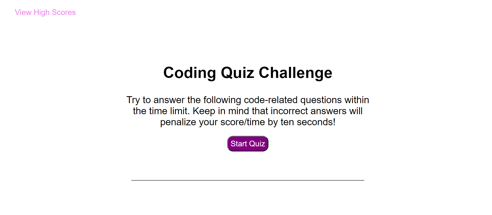

# Code Quiz

## Table of contents
* [Code Quiz Link](https://chiarans.github.io/code-quiz/)
* [General info](#general-info)
* [Technologies](#technologies)

## General info
This project is an application that generates a JavaScript quiz. You are able to choose your answer, check if it is correct, get your score, and save your scores with your initials. 
	
## Technologies
Project is created with (all through VScode extension):
* HTML
* CSS
* JavaScript
	

